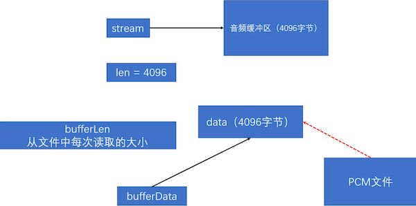
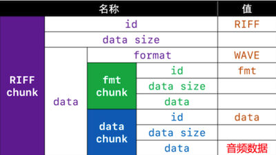
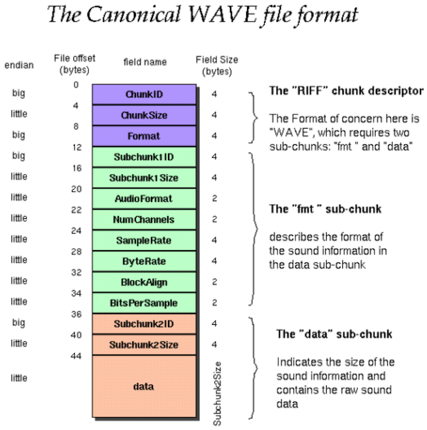

## 一、子线程记录音频

#### 1、 Mac 记录音视频需要申请权限（创建 Info.plist， debug 模式测试）指定路径 QMAKE_INFO_PLIST = xxx/Info.plist
```zsh
<?xml version="1.0" encoding="UTF-8"?>
<!DOCTYPE plist PUBLIC "-//Apple//DTD PLIST 1.0//EN" "http://www.apple.com/DTDs/PropertyList-1.0.dtd">
<plist version="1.0">
<dict>
        <key>NSMicrophoneUsageDescription</key>
        <string>申请使用麦克风</string>
        <key>NSCameraUsageDescription</key>
        <string>申请使用摄像头</string>
</dict>
</plist>
```
#### 2、xxx.pro 配置路径
```zsh
ios {
  FFMPEGHOME = /usr/local/Cellar/ffmpeg/4.3.2_1
}

win32 {
    FFMPEGHOME = ..
}

mac {
    FFMPEGHOME = /usr/local/Cellar/ffmpeg/4.3.2_1

    # Mac 需要 Info.plist 申请音频视频权限，且 debug 才能运行 （avformat_open_input 会 crash）
    # 项目右键 -> Add New -> General -> Empty File -> Info.plist
    # 指定路径 QMAKE_INFO_PLIST = mac/Info.plist
    # （重启QT才生效）
    QMAKE_INFO_PLIST = mac/Info.plist

    # ADD SDL2 HOME
    SDL2_HOME = /usr/local/Cellar/sdl2/2.0.14_1
}

# ADD FFMPEG PATH
INCLUDEPATH += $${FFMPEGHOME}/include

LIBS += -L $${FFMPEGHOME}/lib \
    -lavdevice \
    -lavformat \
    -lavutil

# ADD SDL2 PATH（SDL（Simple DirectMedia Layer），是一个跨平台的C语言多媒体开发库）
INCLUDEPATH += $${SDL2_HOME}/include
LIBS += -L$${SDL2_HOME}/lib \
    -lSDL2
```

#### 3、命令查看支持设备
```zsh
~ ffmpeg -devices -hide_banner

Devices:
 D. = Demuxing supported
 .E = Muxing supported
 --
 D  avfoundation    AVFoundation input device
 D  lavfi           Libavfilter virtual input device
  E sdl,sdl2        SDL2 output device
 D  x11grab         X11 screen capture, using XCB
```

```zsh
~ ffmpeg -f avfoundation -list_devices true  -i dummy -hide_banner

[AVFoundation indev @ 0x7fa29fe30000] AVFoundation video devices:
[AVFoundation indev @ 0x7fa29fe30000] [0] FaceTime HD Camera
[AVFoundation indev @ 0x7fa29fe30000] [1] Capture screen 0
[AVFoundation indev @ 0x7fa29fe30000] [2] Capture screen 1
[AVFoundation indev @ 0x7fa29fe30000] AVFoundation audio devices:
[AVFoundation indev @ 0x7fa29fe30000] [0] Built-in Microphone
```
## 二、播放 `xx.pcm` 文件
#### 1、ffmpeg - 命令
```zsh
~ ffmpeg -f avfoundation -i :0 out.wav #命令录音 

~ fflpay out.wav

~ ffmpeg -i xxx.mp3 -f s16le -ar 44100 -ac 2 -acodec pcm_s16le pcm16k.pcm # 把 mp3 转为 pcm

~ ffplay -ar 44100 -ac 2 -f s16le Desktop/04_05_12_24_06.pcm # 播放 PCM 得输入参数 (s16le windows)
~ ffplay -ar 44100 -ac 2 -f f32le 04_20_10_53_15.pcm # 播放 Mac 录音  (f32le 录音)

~ ffmpeg -ar 44100 -ac 2 -f s16le -i out.pcm out.wav # PCM 转成 WAV （比PCM多78个字节）
# 需要注意的是：上面命令生成的WAV文件头有78字节。对比44字节的文件头，它多增加了一个34字节大小的LIST chunk。

~ ffmpeg -ar 44100 -ac 2 -f s16le -i out.pcm -bitexact out2.wav # 就比 PCM 文件多44字节（WAV 头文件）
# 加上一个输出文件参数-bitexact可以去掉LIST Chunk。

```

- ar: 采样率 (freq, Set the audio sampling frequency.)
- ac: 声道数 (channels, Set the number of audio channels.)
- s16le: PCM signed 16-bit little-endian (有符号、16 位、小段模式)
- -f : format 格式：如 s16le(有符号16小端), f32le（浮点型32位浮点型）
- 更多PCM的采样格式可以使用命令查看
	- Windows：ffmpeg -formats | findstr PCM
	- Mac：ffmpeg -formats | grep PCM

#### 2、ffplay  基于 ffmpeg 和 SDL 两个库实现
- Mac： /usr/local/Cellar/sdl2（brew install ffmpeg 会安装 SDL2）
- Windows： 使用MinGW编译器，需要自己下SDL2

#### 3、pull stream 图


## 三、WAV文件格式
- MJ整理的格式（参考）



- 官方文档格式



- 于是乎推导出头文件格式 `struct`
```cpp
#define AUDIO_FORMAT_PCM 1
#define AUDIO_FORMAT_FLOAT 3

// WAV文件头（44字节）
typedef struct W {
    // RIFF chunk的id
    uint8_t riffChunkId[4] = {'R', 'I', 'F', 'F'};
    // RIFF chunk的data大小，即文件总长度减去8字节
    uint32_t riffChunkDataSize;
 
    // "WAVE"
    uint8_t format[4] = {'W', 'A', 'V', 'E'};
 
    /* fmt chunk */
    // fmt chunk的id
    uint8_t fmtChunkId[4] = {'f', 'm', 't', ' '};
    // fmt chunk的data大小：存储PCM数据时，是16
    uint32_t fmtChunkDataSize = 16;
    // 音频编码，1表示PCM，3表示Floating Point
    uint16_t audioFormat = AUDIO_FORMAT_PCM;
    // 声道数
    uint16_t numChannels;
    // 采样率
    uint32_t sampleRate;
    // 字节率 = sampleRate * blockAlign
    uint32_t byteRate;
    // 一个样本的字节数 = bitsPerSample * numChannels >> 3
    uint16_t blockAlign;
    // 位深度
    uint16_t bitsPerSample;
 
    /* data chunk */
    // data chunk的id
    uint8_t dataChunkId[4] = {'d', 'a', 't', 'a'};
    // data chunk的data大小：音频数据的总长度，即文件总长度减去文件头的长度(一般是44)
    uint32_t dataChunkDataSize;
} WAVHeader;
```
